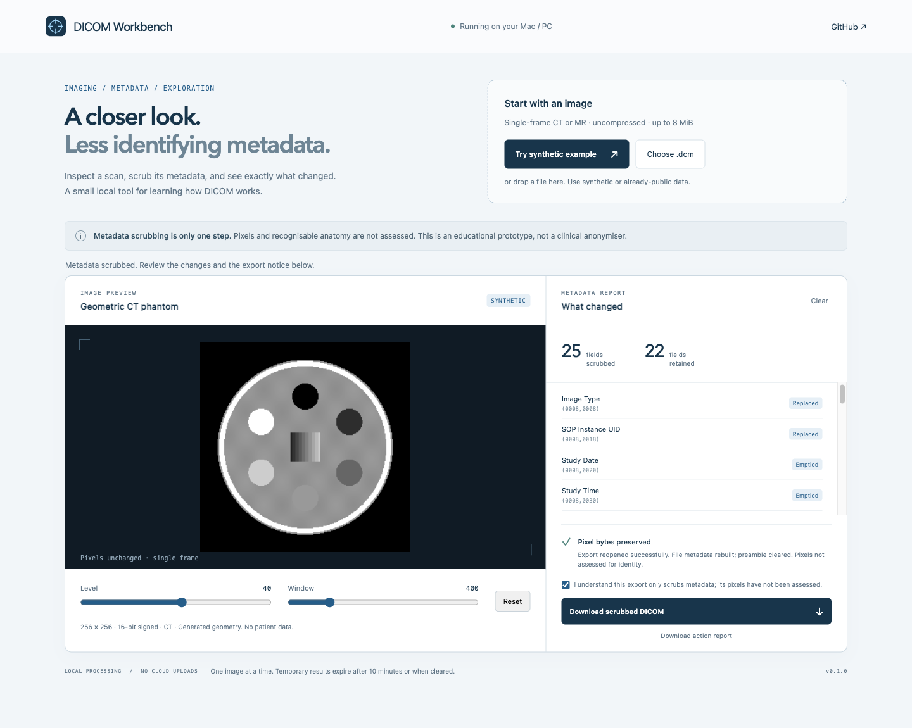

# DICOM Workbench

A small workbench for learning how medical images are stored, displayed and de-identified.

**[Try the browser demo →](https://zakimaths.github.io/dicom-deid-workbench/)** · [Run the local tool](#run-the-local-tool) · [What has been tested](docs/validation.md) · [Research implementation status](docs/implementation-status.md)

Browse 50 larger, labelled MRI, CT and X-ray images. Choose **Open in workbench**, then **NONYMISE** to add fake patient details and practise removing hidden metadata and visible labels. The teaching exercise saves PNGs; the small DICOM examples have their own workflow. The demo needs no installation. [About the teaching collection](docs/teaching-library.md).

[](https://zakimaths.github.io/dicom-deid-workbench/)

## Two ways to try it

| | Browser demo | Local tool |
| --- | --- | --- |
| Where it runs | Static frontend on GitHub Pages | On your computer; macOS setup below |
| Images | 50 teaching pictures, two synthetic examples and six DICOM test fixtures | The same collection, plus supported DICOM files |
| Metadata | Live fake PNG metadata scrubbing; DICOM sample reports are prepared during build | Same PNG exercise, plus live supported DICOM metadata scrubbing |
| Editing | Replaces selected sample pixels in the browser | Replaces selected pixels in a new DICOM file |
| Downloads | PNG preview and exercise report | DICOM file and processing report |

The public site has no processing backend, file-upload control, API keys or analytics code. It fetches its own sample assets; edits stay in the tab. GitHub provides the hosting and keeps ordinary access logs. See [how the preview is built](docs/preview.md).

**This is a learning project, not a clinical anonymiser.** Erasing a rectangle does not find every name or remove recognisable anatomy. The local tool uses a limited metadata policy and does not establish complete DICOM conformance or anonymity. Use synthetic or explicitly permitted public images; an exported file is not automatically safe to publish.

## Run the local tool

Install [uv](https://docs.astral.sh/uv/getting-started/installation/) first. On macOS, `brew install uv` is one option.

```sh
git clone https://github.com/zakimaths/dicom-deid-workbench.git
cd dicom-deid-workbench
uv sync --locked
uv run --locked dicom-workbench serve
```

Open [localhost:8765](http://127.0.0.1:8765) and choose **Try synthetic example** or **Browse 50 teaching scans**. If that port is busy, add `--port 8766` to the serve command. Press `Ctrl+C` in the terminal to stop the app.

The setup installs the pinned Python version and dependencies. Normal use needs no Docker, Node.js or cloud account. After installation, the local tool uses local assets and loopback requests only. Button explanations are available on hover, keyboard focus and in the expandable guide.

## Try a challenge

Open a teaching picture in the workbench. Choose **Challenge** and enter a challenge number, then press **NONYMISE**. The number recreates the same fake labels, including faint or rotated text, labels over anatomy and blank controls. Guided mode still uses easy-to-find margins.

Draw boxes or use keyboard/numeric selection. **Suggest text boxes** runs a local English text reader; review its boxes before erasing. **Check my attempt** reports missed fake labels and unnecessary pixel changes. **Reveal answer boxes** marks the attempt as assisted. Undo restores up to three recent edits; zoom helps with small text. Button help is available without hover.

OCR misses are measured and published, not hidden. The small synthetic held-out test missed 8 of 20 injected identifiers; this is not a clinical accuracy estimate. Source text and recognisable anatomy remain unassessed even when all injected details are removed. [Benchmark method and results](docs/benchmarks.md).

## Try the original DICOM erasing exercise

1. Select **Try a fake-text exercise**.
2. Add the suggested rectangle: left **16**, top **12**, width **132**, height **14**.
3. Select **Erase selected pixels** and inspect the result.
4. Read the export note, then save the result.

You can also draw a rectangle or enter your own coordinates. Pending selections pause downloads. Each image supports one applied edit containing up to 32 rectangles; open it again to start over. The browser demo saves a PNG. The local tool saves a new DICOM and checks that the selected pixels changed as intended while all outside pixels stayed the same.

## What the local tool accepts

One classic CT or MR Part 10 file, up to 8 MiB and 1024 × 1024 pixels. It supports uncompressed Explicit VR Little Endian, one frame, one monochrome channel and 16 allocated/stored bits, with signed or unsigned values.

Compressed images, enhanced multiframe objects, colour, LUT sequences, padding and other unsupported presentation features are rejected. So are files that declare identifying text or recognisable features in their pixels. Missing flags or a `NO` value do not prove that the pixels are clear.

The metadata policy retains selected numeric imaging fields and strictly checked acquisition codes, empties specified identity fields, remaps identifiers, and drops private data and sequences. Required classic MR fields are now handled explicitly. A bounded collection command preserves study, series and frame continuity; sequence references and date shifting remain unsupported. [Supported formats](docs/supported-formats.md) · [IOD rule coverage](docs/iod-coverage.md) · [Policy limits](docs/policy.md).

## Run the checks

```sh
uv run --locked pytest -q
uv run --locked ruff check .
uv run --locked python scripts/reproduce.py
```

The reproduction file records the environment and fixture/pixel/report digests. Output identifiers are deliberately random, so repeatability means the same processing results, not identical DICOM files.

For the browser checks, install Node.js 22 or newer:

```sh
npm ci --ignore-scripts
npx playwright install chromium firefox webkit
npm test
npm run test:browser
npm run build:preview
npm run test:preview
npm run test:exercise
npm run test:accessibility
npm run benchmark:ocr
```

The browser suites start their own temporary local servers. On Linux, Playwright may need `npx playwright install --with-deps chromium firefox webkit` to install browser dependencies. Generated files stay under ignored `output/`.

GitHub Actions checks the local Python tool on Linux and both Mac architectures, and browser workflows on Linux and macOS ARM. The static preview has its own checks before deployment. [Validation history](docs/validation.md) and the [0.2.1 audit](docs/audit-0.2.1.md) explain what those results cover.

## Use the command line

```sh
uv run --locked dicom-workbench fixture /tmp/synthetic.dcm
uv run --locked dicom-workbench scrub /tmp/synthetic.dcm /tmp/scrubbed.dcm --report /tmp/scrub-report.json
```

Add `--with-text` when generating a fixture to include the fake text. Pass a JSON array of `{x, y, width, height}` rectangles with `scrub --regions /path/to/regions.json` to erase selected pixels. Choose new output paths each time: existing files are never overwritten.

For a supported single study (up to 16 files), choose a new output directory:

```sh
uv run --locked dicom-workbench scrub-collection /tmp/new-study /path/to/slice1.dcm /path/to/slice2.dcm
```

Mappings stay in memory and never appear in reports. This preserves UID continuity within the supported subset; it is not full study reconstruction.

## How it is built

The local tool uses Python and [pydicom](https://pydicom.github.io/) for DICOM parsing and writing. Plain JavaScript and Canvas handle the viewer. For this small, uncompressed, single-frame scope, that keeps the setup manageable.

Text suggestions use pinned, self-hosted Tesseract.js 7 and English model assets. Images and recognised strings never go to a cloud OCR service. The worker is terminated after each run; no recognised strings enter reports or persistent storage.

The public demo shares the visual design and pixel-display functions. A build step prepares the known examples, then publishes only HTML, CSS, JavaScript, fonts, sample JSON and the teaching pictures. Python runs during the build and in the optional local tool; it is not deployed as a web service.

The next support decisions are native X-ray/compressed DICOM, reference-bearing collections and independently reviewed real-world text datasets. Full-volume defacing remains a separate research task. The [research roadmap](docs/anonymisation-roadmap.md) and [implementation prompts](docs/prompts/README.md) break that work into smaller tasks.

## Sources and contributing

The [50 teaching pictures](docs/teaching-image-credits.md) come from individually credited open-licence or public-domain Wikimedia Commons sources. They are JPEG views, not DICOM volumes.

The six small DICOM CT/MRI examples come from pydicom's existing NEMA and PCIR test collections. Four are only 16 × 16 pixels and are useful for edge-case testing, not anatomical detail. [Sources, hashes and preparation](docs/public-samples.md).

Project code is MIT licensed. Vendored OCR software and model data retain their own licences; see [third-party notes](docs/third-party.md). Teaching images and thumbnails retain their individual licences, including ShareAlike where applicable. The bundled fonts have their own SIL Open Font Licences. Please use synthetic examples in bug reports and never attach patient data. Read the [security notes](SECURITY.md) before reporting a sensitive issue.

[Contributing](CONTRIBUTING.md) · [Release checklist](docs/release-checklist.md) · [Changelog](CHANGELOG.md) · [Sharing drafts](docs/share.md) · [LinkedIn](https://www.linkedin.com/in/alhasan-alkaseem/) · [X](https://x.com/vesperlemma) · [GitHub](https://github.com/zakimaths)
